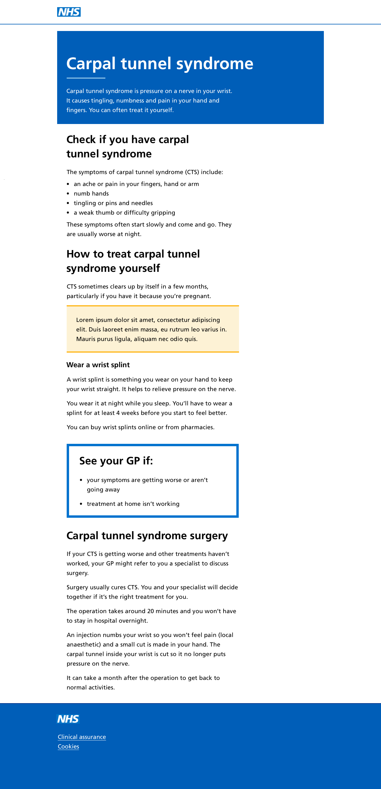

These are a combination of units and components to address a user need.

  

    <h3>Example in a large viewport</h3>
    

      
    

  

  

    <h3>Example in a small viewport</h3>
    

      
    

  

