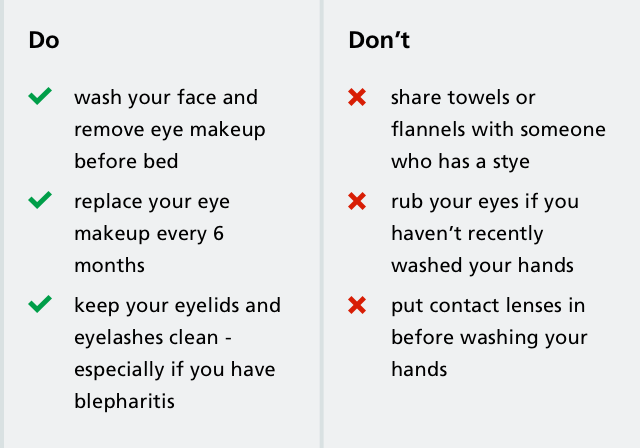

We use binary lists to display 2 related lists of content. These are displayed in a 2 column layout on
large viewports. We stack one on top of the other on smaller viewports.

#### Example in a large viewport

  

#### Example in a small viewport

  

