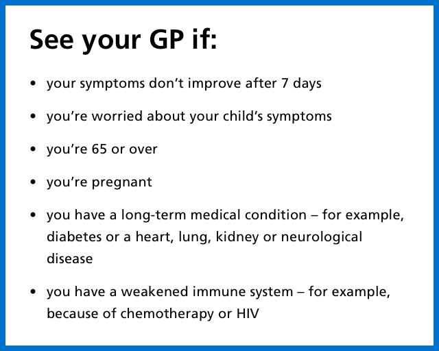
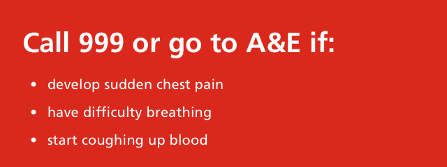
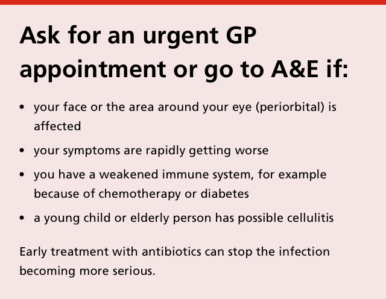
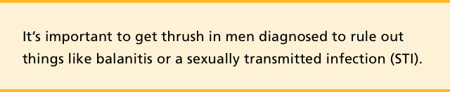
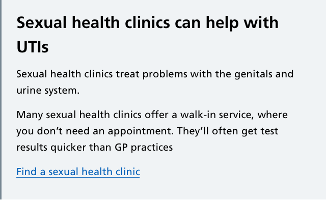

We use callouts to draw attention to important areas of content.

#### Primary care

We use a callout with a blue border to indicate when people should seek help from a medical professional for
their condition. For example, when to see a GP or practice nurse.

##### Example

  

  

#### Emergency care

We use a callout with a red background to indicate when people are in danger and should take immediate action.
For example, when to call 999.

##### Example

  

#### Urgent care
We use a callout with a pale pink background and red border to indicate when fast action should be taken to avoid
an emergency. For example, when to go to A&E or get an urgent doctor’s appointment.

##### Example

  

#### Important

We use a callout with a pale yellow background and darker yellow borders to highlight information about risks or
give one-off instructions.

##### Example

  

#### Information

We use a callout with a grey background and dark grey border to provide contextual information where needed.
This callout is often combined with a link to make a priority action.

##### Example

  

