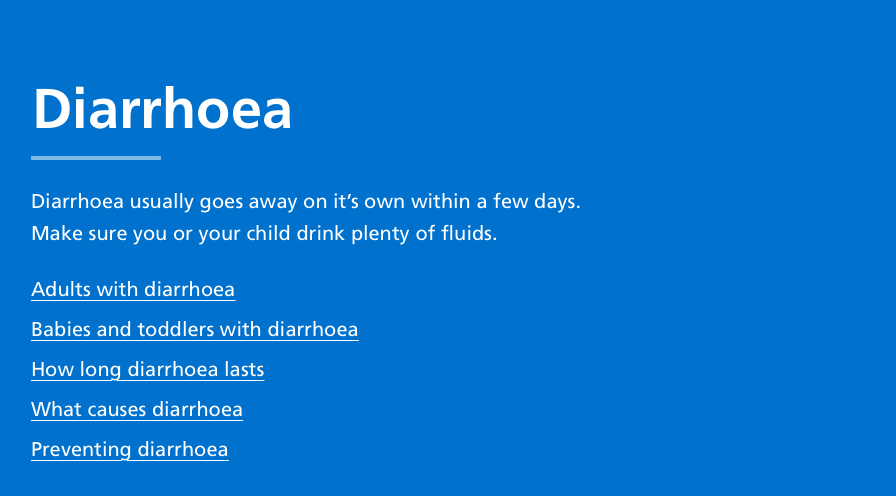

The local header appears at the top of the page. It usually contains a combination of the page title,
description and page navigation.

#### Local header with description

  

#### Local header with on page navigation

  

#### Local header for guide

  

